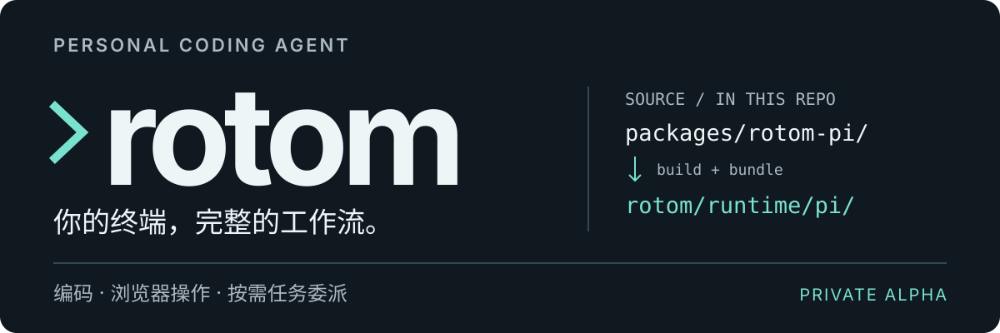

<p align="center">
  
</p>

# rotom

**你的终端，完整的工作流。** 基于仓内 [Pi fork](packages/rotom-pi/ROTOM-FORK.md) 的个人 coding agent，在你的项目目录中编码、操作浏览器，并按需委派任务。

[开始使用](#开始使用) · [能力一览](#能力一览) · [工作方式](#工作方式) · [文档](#文档)

> **Private alpha · Node.js 24+** — 源码已公开，npm 包尚未公开发布。安装产物内置 Pi fork，无需另装全局 Pi，也不依赖旁边的源码仓库。

## 开始使用

拿到本地打包的 `.tgz` 后，在你的业务项目中启动：

```sh
# 将路径替换为实际发行包
npm install -g --ignore-scripts '/absolute/path/to/rotom-<version>.tgz'
cd /path/to/your/project
rotom
```

首次进入后，用 `/login` 登录模型服务，再用 `/model` 选择模型；也可自行配置 API key。

- **还没有安装包？** 参阅[构建与分发](docs/agent/distribution.md)，不要执行 `npm install -g rotom`。
- **升级已有安装？** 使用[版本隔离安装](docs/agent/distribution.md#可复现的多版本安装维护标准)，保留仍有会话使用的旧目录，不原地覆盖。
- **想使用 Qoder？** 按下方说明显式启用，默认不注册该 provider。

## 能力一览

| 能力 | 如何使用 |
|---|---|
| **编码** | 读取、编辑文件和执行命令；保留业务目录、用户参数与项目上下文。 |
| **Browser / Computer Use** | 基于目标和当前观测操作页面或桌面；写入结果未知时不自动重放。 |
| **按需 Subagent** | 通过 `search_tools` 加载任务委派能力，不把所有专用工具常驻上下文。 |
| **本地 trace** | 记录必要的状态、耗时与 usage 等 metadata，不记录 prompt 或工具正文。 |
| **Qoder · opt-in** | 原生登录、账号模型目录与 Credit 观察；仅开放已验证能力，仍属 experimental。 |

### 可选：Qoder

```sh
ROTOM_QODER=1 rotom
```

进入后执行 `/login qoder-experimental`，完成浏览器授权，再用 `/new` 开启新会话、`/model` 选择模型。默认采用 Pi 原生浏览器登录；只读 Qoder CLI 凭据模式需显式设置 `ROTOM_QODER_AUTH=qodercli`。

模型清单、思考档位、图片与上下文限制见 [Qoder 使用说明](rotom/README.md#qoder原生-provider显式启用)。**Credit 不等于 USD**；缺失计量保持 unknown，不将零价格占位当作免费。

## 工作方式

<p align="center">
  
</p>

**项目上下文 → rotom 的包内 Pi → 按任务选择工具。** 图示表达调用结构，不是执行隔离或权限边界。

- **仓内维护，随包交付。** `packages/rotom-pi/` 保存 Pi fork 源码；`rotom/runtime/pi/` 管理其构建归档、锁文件与来源摘要。
- **默认入口固定。** `rotom` 从安装包内部加载 Pi，缺失或身份漂移即停止，不悄悄回退全局 Pi。`ROTOM_PI` 仅用于显式维护覆盖。
- **工具按需增加。** 专用能力加载后留在当前会话；用户显式工具选择优先。按需加载是上下文优化，不是安全沙箱。

构建、隔离安装与默认／完整工具 smoke 的记录，以及 PTY 和 shell 检查的未完成项，见 [Pi fork 接入与验证](docs/agent/pi-fork.md)。这些记录不是模型效果或 benchmark 优势证明。

## 使用前请了解

- **本机权限，不是沙箱。** 工具以启动 rotom 的本机用户权限运行，目前没有统一权限确认层。
- **浏览器需要单独设置。** Chrome relay 的安装、加载／重载和系统权限由用户明确完成，不由 npm 安装脚本代办。
- **新版本不迁移活跃会话。** 当前 fork 已完成本机 macOS arm64 安装验证；新内置依赖闭包的 Linux／其他 CPU 验证仍未完成，Windows 原生入口不受支持。
- **未知就是未知。** 外部写入超时或结果无法证明时，不当作成功，也不盲目重试。公开发布、真实 Chrome 验收和评测的待办见[发布准备记录](docs/agent/release-preparation.md)。

## 文档

| 你想了解 | 从这里开始 |
|---|---|
| 安装、登录与日常使用 | [产品使用说明](rotom/README.md) |
| 构建安装包、升级和卸载 | [分发指南](docs/agent/distribution.md) |
| Pi fork 的来源与维护 | [Fork 维护说明](packages/rotom-pi/ROTOM-FORK.md) · [接入与验证](docs/agent/pi-fork.md) |
| 源码结构与运行时合同 | [架构与代码地图](docs/agent/architecture.md) |
| Subagent 默认行为与限制 | [Scoped 执行合同](docs/agent/subagent-owned-default.md) |
| 测试与评测 | [验证与交付](docs/agent/verification.md) · [评测入口](rotom/evals/README.md) |
| 维护和公开前检查 | [维护约定](CLAUDE.md) · [隐私审计](docs/agent/privacy-release.md) |

## 名称与许可

产品与仓库名均为小写 **rotom**，项目仓库为 [bingjiang0611/rotom](https://github.com/bingjiang0611/rotom)。名称取自宝可梦洛托姆，但这是独立项目，不是 Pi 或宝可梦官方产品，也不暗示官方授权；本仓库未采用官方角色素材。

公开仓库采用 [MIT 许可证](LICENSE)，第三方代码保留各自许可证，见[第三方声明](rotom/THIRD_PARTY_NOTICES.md)。npm 产品元数据仍为 `private: true`、`UNLICENSED`，本次源码同步不更改发行元数据，也不代表 npm 发布批准。MIT 许可不授予第三方商标权，名称／IP 使用仍需独立审查。
